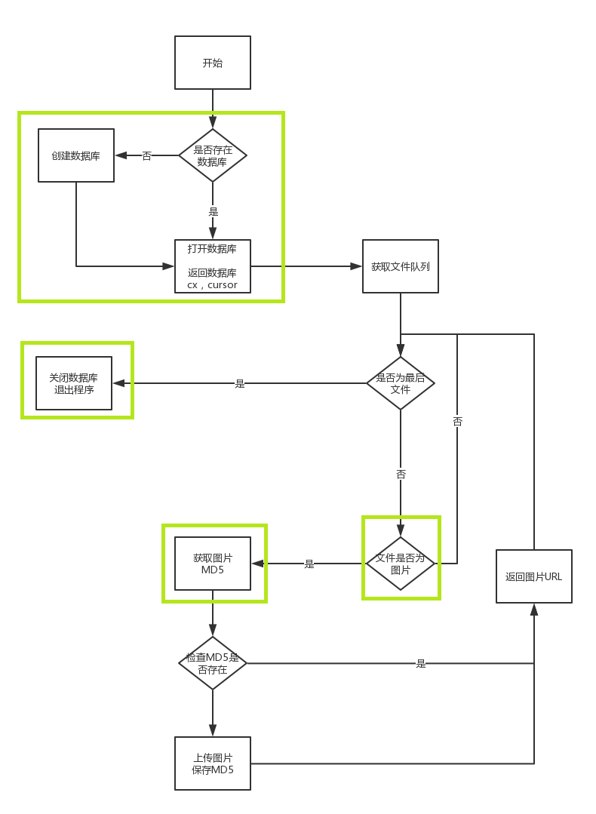

# QINIU IMAGE STORE

A python tools to upload images into qiniu bucket, which stored as files' md5-hash as filename.

Uploaded images' info will be store in a sqlite3 database which is localfile. Likes ` md5-hash, image-prefix, image-type `.

## requirements
qiniu 7.0.9.1


## Usage

1. Compele your user_conf.py
2. upload images to qiniu bucket

```
usage: 
python qiniu3.py path/to/file1.jpg [path/to/file2.png path/to/file3.png ...]
```


## workflow

When you are uploading a file, it follows:

1. To check the file is or not an image file.
2. To check the file is or not uploaded.
  + true: return the qiniu-image url 
  + next file
3. To upload into qiniu
  + return qiniu-image url
  + insert image info into database
  + next file



